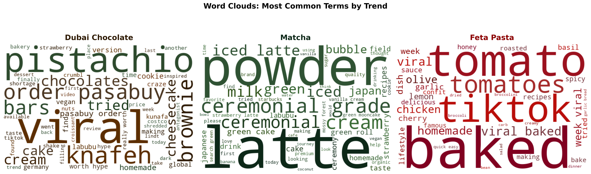
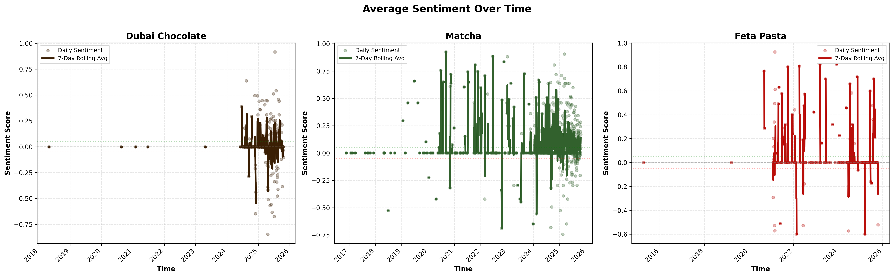
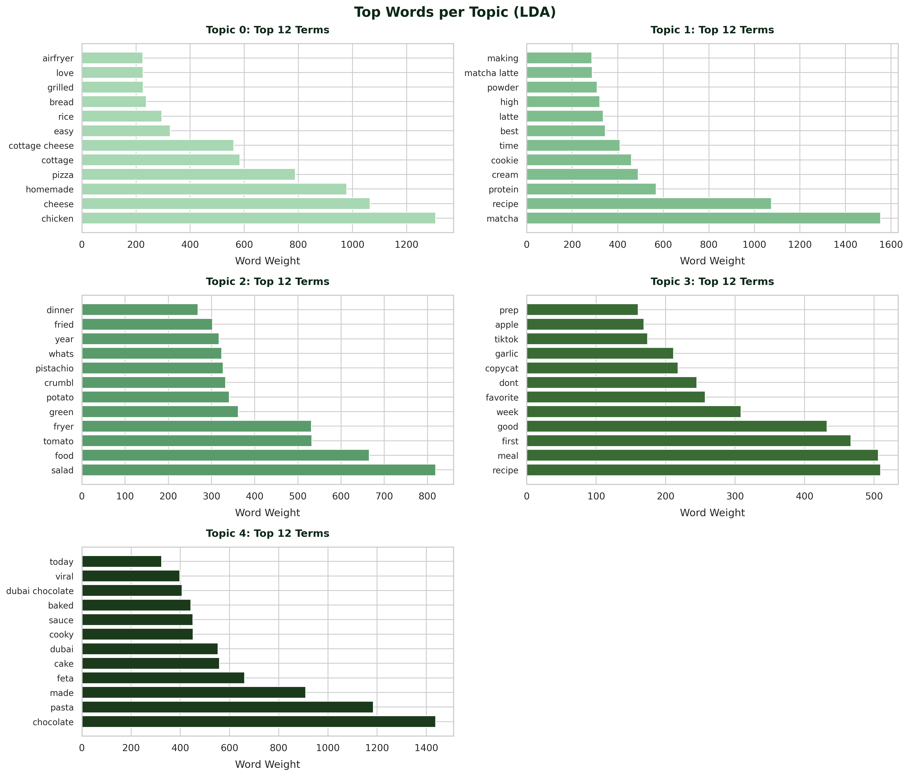

# Food-Trend-Insights
This is university capstone project exploring the lifecycle of digital food trends across YouTube, Reddit, and Google Trends. We focus on clear visual storytelling and this repo offers a polished summary of our core findings, key figures, and concise explanations.

**Authors:** Kadeeja Zumreen · Sriya Kondury · Sayalee Chivate  

---

## Table of Contents
- [Overview](#overview)
- [Data Sources](#data-sources)
- [Trend Lifecycle Analysis](#trend-lifecycle-analysis)
- [Geographic Diffusion](#geographic-diffusion)
- [Sentiment and Discussion Analysis](#sentiment-and-discussion-analysis)
- [Topic Modeling (LDA)](#topic-modeling-lda)
- [Cross-Platform Comparison](#cross-platform-analysis)

---

<strong>Overview</strong>

  
Digital food trends increasingly emerge, spread, and decline through online platforms, shaping consumer behavior, cultural adoption, and global food discourse. Unlike traditional food movements, modern trends often follow nonlinear lifecycles driven by search behavior, content creation, influencer activity, and community discussion across social media ecosystems.

This project analyzes the lifecycle of four digital food trends — **Matcha**, **Baked Feta Pasta**, **Dubai Chocolate**, and **Air Fryer** — from 2015 to 2025 using data from **Google Trends**, **YouTube**, and **Reddit**. By examining temporal patterns, geographic diffusion, sentiment dynamics, and discussion themes, we investigate how trends originate, how quickly they scale, and whether they fade as short-lived viral phenomena or persist through long-term cultural and practical adoption.

Through a cross-platform, data-driven approach, this repository presents clear visual narratives that highlight distinct diffusion models, differences between viral and sustained trends, and the role of public curiosity, media amplification, and community engagement in shaping digital food lifecycles.

---

<strong>Data Sources</strong>

### YouTube Data  
Collected using YouTube Data API v3. Includes:
- Video metadata (titles, descriptions, duration)  
- Engagement metrics (views, likes, comments)  
- Upload timelines  

### Google Trends  
Collected via PyTrends. Includes:
- Weekly search interest (0–100 scale)  
- Global and country-level data (US, India, UAE, South Korea)  
- Region-by-region comparison for each trend

### Reddit Data  
Collected using PRAW. Includes:
- Post titles, scores, comments, timestamps  
- Subreddit distribution  
- Sentiment + topic modeling inputs  

---

<strong>Trend Lifecycle & Temporal Patterns</strong>

This section examines how food trends evolve over time by comparing public curiosity, creator adoption, and audience attention. Together, these signals distinguish short lived viral trends from those that achieve sustained cultural or practical relevance. 

### Public Interest Over Time

*Google Trends search interest (0-100) showing when public curiosity emerges, peaks, and declines for each trend.*

### Content Creation Dynamics

*Weekly YouTube video uploads highlighting differences between rapid viral adoption and gradual, sustained content growth.*

### Audience Attention and Reach

*Weekly total YouTube views showing how audience attention scales and concentrates across different trend lifecycles.*

### Trend Lifecycle

*Spiral visualization summarizing the pace and duration of each trend's lifecycle, contrasting viral bursts with long term adoption*

---

<strong>Geographic Diffusion of Trends</strong>

We explored how digital food trends spread geographically and how adoption varies across regions. Using Google Trends data, we map relative search interest to identify each trend's regional concentration and degree of global diffusion.

### Regional Interest by Trend

*Geographic distribution of search interest for Matcha, showing widespread and sustained global adoption.*

*Search interest for Dubai Chocolate, highlighting strong regional concentration centered around its point of origin.*

*Geographic diffusion of Baked Feta Pasta, illustrating a short-lived viral spread with limited long-term regional adoption.*

*Regional adoption of Air Fryer searches, reflecting broad and sustained interest consistent with utility-driven diffusion.*

---

<strong>Sentiment and Discussion Analysis</strong>

We used the VADER (Valence Aware Dictionary and Sentiment Reasoner) lexicon to analyze the tone of Reddit discussions. This allowed us to classify trends as long-term or short-lived based on whether community sentiment remained positive and diverse over time.

### Thematic Word Clouds

*This word cloud depicts the most frequently used terms, uncovering unique patterns in how users discuss food trends. For **Feta Pasta**, terms like "tomato," "tiktok," and "baked" emphasize its identity as a short-term viral recipe. In contrast, **Matcha** discussions focus on ritual and preparation ("ceremonial," "powder," "latte"), reflecting its role as a lifestyle staple. **Dubai Chocolate** stands out with purchasing-forward terms like "order" and "pasabuy," highlighting its status as a sought-after luxury item.*

### Sentiment Distribution Analysis

*This distribution shows that while the majority of posts cluster near neutral (zero), **Matcha** exhibits a wider spread toward positive sentiment, likely due to its wellness associations. **Feta Pasta** displays a higher density of negative posts, reflecting the "trend fatigue" that set in after its 2021 peak. **Dubai Chocolate** shows a narrower, modest positive sentiment, indicating favorable but highly focused engagement.*

### Sentiment Trends over Time

*By tracking daily sentiment scores with a **7-day rolling average**, we can see the lifecycle in action. **Matcha** maintains a stable, positive baseline over years of data. **Feta Pasta** shows a massive spike during its viral window in 2021 followed by a steady decay. **Dubai Chocolate** shows a rising sentiment trajectory into 2025, marking it as a current "growth" trend.*

---

<strong>Topic Modeling (LDA)</strong>

To uncover the core themes driving these trends, we applied **Latent Dirichlet Allocation (LDA)** to Reddit discussions. By selecting **$K=5$** topics, we were able to identify distinct "conversation pillars" that explain why some trends persist while others fade.

### Thematic Keywords by Cluster

*This visualization highlights the five distinct conversation pillars identified through LDA modeling. Our analysis reveals a clear divide in how users discuss different lifecycles:*

* **Viral Novelty (Topic 4):** Discussions around **Dubai Chocolate** and **Baked Feta Pasta** are heavily centered on the "viral" nature of the items, with keywords like *feta, pasta, chocolate,* and *cake*.
* **Routine & Preparation (Topics 0 & 1):** Sustained trends like **Matcha** and **Air Fryer** generate more diverse and practical discourse, focusing on ingredients and daily habits (e.g., *latte, protein, chicken, cottage cheese*).
* **Experimentation (Topics 2 & 3):** Users frequently share "copycat" recipes and unconventional uses for tools like the Air Fryer (e.g., *pistachio, salad, potato*), showing how long-term trends evolve through community creativity.

*Overall, these clusters prove that short-term viral trends are driven by novelty, while long-term trends sustain interest by integrating into broader, more diverse lifestyle conversations.*

### Topic Mix by Trend & Evolution Over Time

*This stacked bar chart shows how the LDA topics are distributed across our focus trends. **Matcha** is dominated by Topic 1 (drink preparation), whereas **Dubai Chocolate** and **Feta Pasta** are almost entirely composed of Topic 4 (viral novelty). The **Air Fryer** shows the most diverse distribution across Topics 0, 2, and 3, marking it as a sustained long-term trend with multiple utility-based use cases.*

*This plot tracks conversation shifts from 2015–2025. Around 2020–2021, Topic 4 (viral discussion) spiked dramatically, correlating with TikTok-inspired pandemic recipes. However, as that spike decayed, Topics 1 and 2 (Matcha and Air Fryer) continued to grow at a steady rate, showing that long-term trends persist by becoming part of everyday consumer behavior.*

<strong>Cross-Platform Comparison & Predictive Modeling</strong>

This section synthesizes data from **Google Trends, YouTube, and Reddit** to identify how food trends ripple through different digital ecosystems. Our analysis reveals a distinct pattern: **Discovery (Search) $\rightarrow$ Amplification (Content) $\rightarrow$ Participation (Discussion).**

### Cross-Platform Engagement Patterns
 
This section compares data from **Google Trends, YouTube, and Reddit** to identify how food trends ripple through different digital ecosystems. Our analysis reveals a distinct pattern: **Discovery (Search) $\rightarrow$ Amplification (Content) $\rightarrow$ Participation (Discussion).**

### The Lifecycle Ripple Effect
 
*This visualization depicts how public interest shifts across platforms, uncovering the "lag" between initial curiosity and community-level discussion.*

#### Key Findings by Trend Lifecycle:
* **Dubai Chocolate (The Recent Spike):** Exhibited a clear sequential spread. A dramatic increase in **Google Search (Feb 2025)** was followed by a peak in **YouTube Views (April 2025)** and finally **Reddit Comments (May 2025)**.
* **Baked Feta Pasta (The Viral Burst):** Showed a highly condensed and synchronized cycle in early 2021. The global spike on Google Trends was followed almost immediately by Reddit and YouTube activity, characteristic of a short-lived viral phenomenon.
* **Matcha & Air Fryer (Sustained Adoption):** These trends show steady, overlapping peaks over several years. **Air Fryer** peaked across Google and Reddit in Dec 2022, with YouTube following in Feb 2023, reflecting stable, utility-driven adoption rather than temporary novelty.

### Statistical Correlation Across Platforms
To quantify these relationships, we compared weekly activity levels using **Pearson Correlation Coefficients**. This statistical approach confirms that Google Search Interest typically captures the earliest rise in curiosity, acting as a leading indicator for content creation and community engagement.

| Google vs. YouTube | Google vs. Reddit | YouTube vs. Reddit |
| :---: | :---: | :---: |
|  |  |  |

*These scatterplots demonstrate how changes in search interest correspond to changes in video engagement and community discussion. High Pearson coefficients in the early phases of a trend confirm that Google Trends typically captures the earliest rise in public curiosity, acting as a leading indicator for the other platforms.*

